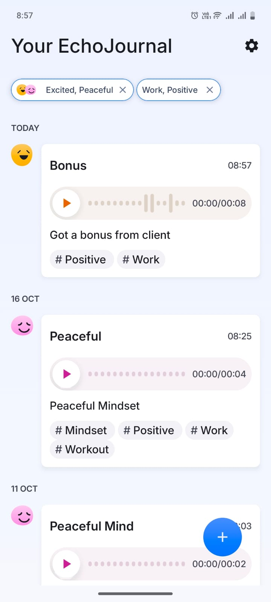
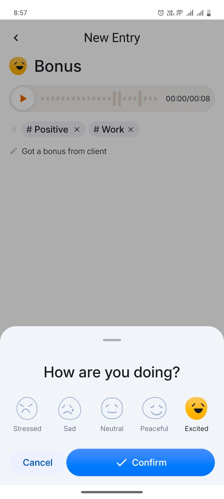
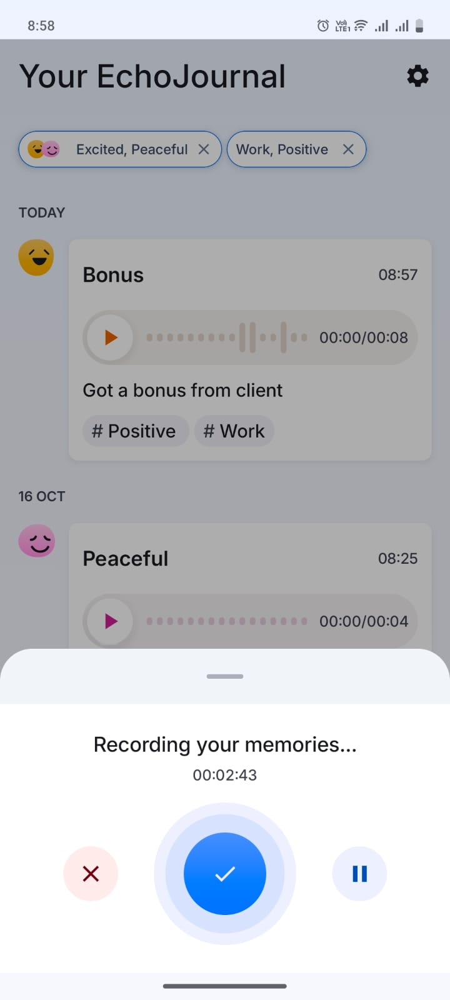
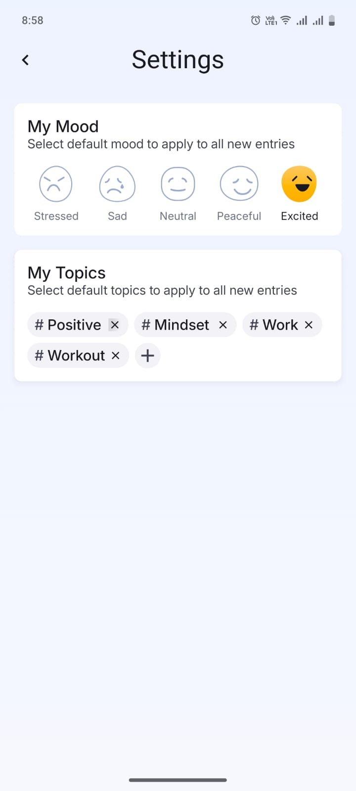

# 🎙️ Echo Journal

**Echo Journal** is a modern Android app built with **Kotlin**, **Jetpack Compose**, **Flow**, **Coroutine** and **Room**, designed to help users **record voice notes** along with **text notes and mood tracking**.  

It seamlessly blends **audio journaling** with **written reflections**, letting you capture thoughts, feelings, and moments — anytime, anywhere.

---

## 🖼️ App Screenshots

| Home Screen  | Record Note   | Record Voice   | Settings  |
|--------------|---------------|----------------|-----------|
|  |  |  |  |

---

## 📱 App Overview

Echo Journal allows users to:

- 🎤 **Record voice entries** with one tap  
- 📝 **Add written notes** alongside recordings  
- 😊 **Attach mood or emotion tags** to each entry  
- 💾 **Access entries offline** anytime  
- 🕒 **Track timestamps** and sync status for each record  

This makes it a perfect **digital journal** for personal reflection, mindfulness, or quick idea capturing.

---

## 🧠 What I’ve Learned

Building Echo Journal strengthened my understanding of full-stack Android app development with **modern Jetpack tools**.  

Key areas of learning include:

- **Kotlin Coroutines & Flow** for reactive, asynchronous data handling  
- **Jetpack Compose** for declarative and dynamic UI design  
- **Room Database** for local persistence and caching  
- **MVVM + Repository Architecture** for clean, scalable structure  
- **Android Audio Recording APIs** for capturing and storing voice notes  
- **Dependency Injection (Koin)** for cleaner and testable code  
- **Material 3 Design** for a modern, user-friendly interface  

---

## 🛠️ Technologies & Tools Used

| Category | Tools / Libraries |
|-----------|-------------------|
| **Language** | Kotlin |
| **UI Framework** | Jetpack Compose |
| **Dependency Injection** | Koin |
| **Architecture** | MVVM + Repository Pattern |
| **Async Handling** | Kotlin Coroutines, Flow |
| **Local Storage** | Room Database |
| **Audio Handling** | Android MediaRecorder / MediaPlayer APIs |
| **Design System** | Material 3 |
| **Version Control** | Git & GitHub |
| **IDE** | Android Studio |
| **Build Tool** | Gradle |

---
